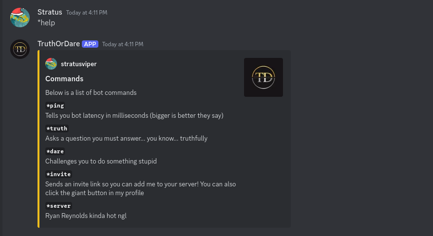

# Truth or Dare Discord Bot

## Overview
The **Truth or Dare Discord Bot** is a fun and interactive bot designed to bring excitement to your Discord server. With its variety of commands, the bot allows users to challenge their friends with daring tasks or reveal their truths. The bot is easy to set up, fully customizable, and comes with a help menu to guide users through its commands.

---

## Features
- Interactive and User-Friendly
- Displays commands in an embedded message for clarity and visual appeal.
- Includes user avatars in responses for a personalized experience.
- Provides server statistics at startup for administrative convenience.

### Core Commands
- **`*help`**: Display a list of all available commands and their descriptions.

- **`*truth`**: Get a random question that must be answered truthfully.

- **`*dare`**: Receive a random challenge to perform.

- **`*ping`**: Check the bot's latency in milliseconds.

